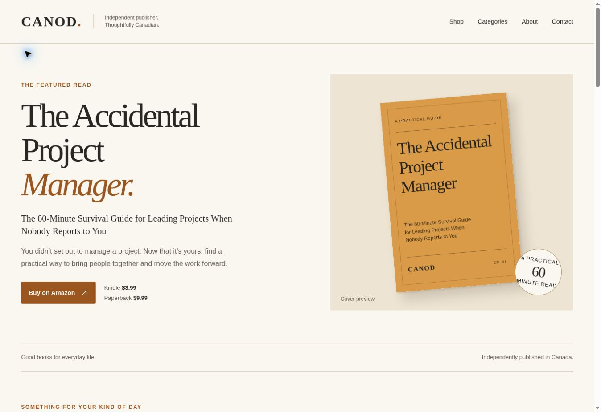

# CANOD bookstore

A warm, mobile-first publisher catalog for **canod.store**. Static HTML, CSS, and a small JavaScript enhancement; no runtime dependencies, shopping cart, checkout, analytics, or cookies. The complete catalog and navigation remain readable with JavaScript off.

Source repository: https://github.com/kamxnet/canod-bookstore



## Site content

- Homepage with the featured Accidental Project Manager, three category cards, all 11 titles, about, newsletter, and contact footer.
- `/word-search/` — 5 titles.
- `/coloring-books/` — 2 titles.
- `/logbooks-journals/` — 3 titles.
- `/practical-guides/` — 1 title.
- Custom 404, sitemap, canonical metadata, and favicon.

Collections use paths on one domain. Separate subdomains are unnecessary for this catalog and are not configured.

## Edit and build

Requires Node.js 20 or newer. There is no package installation step.

```sh
npm run build
npm run check
npm run dev
```

Edit `content/books.json` for titles, descriptions, bylines, display prices, cover paths, and Amazon links. `CANOD` is an editable house byline placeholder for every title; replace it with each book's published author name before launch. The dollar prices are reproduced exactly as supplied without an invented currency designation; verify the marketplace/currency before publishing real sales links.

The generator writes the complete publication to `docs/`. Commit both source and regenerated `docs/` when updating. No browser-side API keys or secrets are required.

## Replace the requested placeholders

1. **Amazon links:** replace each `amazonUrl: "#"` with the title's HTTPS Amazon product URL. A missing link displays an honest “coming soon” message. It never simulates a purchase. All 12 initial purchase links are `#` exactly as requested.
2. **Cover images:** put the real JPG, PNG, WebP, or SVG cover in `assets/covers/`, update its `cover` path in `content/books.json`, then build. Portrait 2:3 images work best. Existing images are never overwritten by the generator. Current SVGs are typography-only stand-ins, not approved cover designs.
3. **Contact:** set `contactEmail` in `content/site.json` to an active mailbox. Until then, `hello@canod.store` is visibly presented as a coming-soon address, without a mailto link.
4. **Newsletter:** the email field and Subscribe button are disabled until a real provider is configured. No address is saved locally, sent elsewhere, or represented as subscribed. Set `newsletter.action` to your provider's public HTTPS form POST URL, `emailField` to the provider's expected field name, and `hiddenFields` to its non-secret form fields. Add the provider's `privacyUrl`. Confirm the provider's opt-in, consent, unsubscribe, and success/error pages before enabling; no API secret belongs here. The browser then submits directly to that provider, which owns storage and confirmation. Do not use an API-only endpoint.

## Publish to GitHub Pages

This bookstore uses the separate **kamxnet/canod-bookstore** repository. Do not switch the Pages source of `canod-web2`: it currently serves **canod.ca**.

1. Repository created: `kamxnet/canod-bookstore` (public).
2. Website source and ready-to-publish `docs/` files are on its `main` branch.
3. In **Settings → Pages**, set **Deploy from a branch**, branch **main**, folder **/docs**, and save.
4. Set the custom domain to **canod.store**. The included `docs/CNAME` already contains it.
5. At the domain's DNS provider, set the apex (`@`) A records to the four GitHub Pages addresses below. Replace conflicting web A/AAAA records only; preserve mail, TXT, and verification records.

| Type | Host | Value |
| --- | --- | --- |
| A | @ | 185.199.108.153 |
| A | @ | 185.199.109.153 |
| A | @ | 185.199.110.153 |
| A | @ | 185.199.111.153 |
| CNAME | www | kamxnet.github.io |

6. Once DNS validates and the certificate is issued, enable **Enforce HTTPS**. Verify the home page and all four collection pages on the domain.

GitHub reference: https://docs.github.com/en/pages/configuring-a-custom-domain-for-your-github-pages-site/managing-a-custom-domain-for-your-github-pages-site

For a temporary project URL before DNS is ready, omit `docs/CNAME` and set `site.url` to the actual GitHub Pages URL before rebuilding. The main routes and assets are relative and work beneath a repository path; update the 404 root links to the project path if using that temporary URL. The delivered configuration targets `https://canod.store`.

## Status

Website implementation is complete. Publishing and DNS are separate account operations and must be verified before describing the site as live. Newsletter delivery is intentionally unconfigured. Amazon URLs, covers, contact, and bylines remain editable placeholders as documented above.
